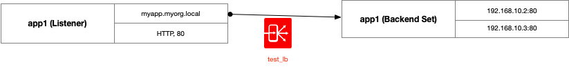

# OCI Load Balancer Core Module Example (HTTP, no SSL/TLS)

## Introduction

This example shows how to use the load balancer core module, showing how to configure a basic HTTP listener (and HTTP Backends).

## Topology Diagram
This example is intended to the following OCI topology:


Here's a logical diagram of the LB configuration:



## Using this example
Prepare one variable file named `terraform.tfvars` with the required information (or feel free to copy the contents from `terraform.tfvars.template`).  The contents of `terraform.tfvars` should look something like the following:

```
tenancy_ocid = "ocid1.tenancy.oc1..xxxxxxxxxxxxxxxxxxxxxxxxxxxxxxxxxxxxxxxxxxxxxxxxxxxxxxxxxxxx"
user_ocid = "ocid1.user.oc1..xxxxxxxxxxxxxxxxxxxxxxxxxxxxxxxxxxxxxxxxxxxxxxxxxxxxxxxxxxxx"
fingerprint= "xx:xx:xx:xx:xx:xx:xx:xx:xx:xx:xx:xx:xx:xx:xx:xx"
private_key_path = "~/.oci/oci_api_key.pem"
region = "us-phoenix-1"
default_compartment_ocid = "ocid1.compartment.oc1..xxxxxxxxxxxxxxxxxxxxxxxxxxxxxxxxxxxxxxxxxxxxxxxxxxxxxxxxxxxx"
```

Then apply the example using the following commands:

```
$ terraform init
$ terraform plan
$ terraform apply
```

## License

Copyright (c) 2020 Oracle and/or its affiliates. 

Licensed under the Universal Permissive License 1.0

See [LICENSE](../../LICENSE) for more details.
