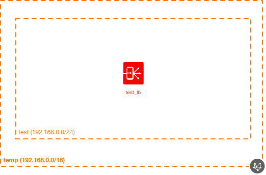
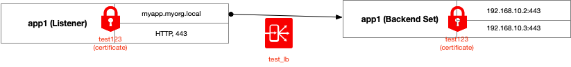

# OCI Load Balancer Core Module Example (HTTPS - SSL/TLS)

## Introduction

This example shows how to use the load balancer core module, showing how to configure end-to-end SSL/TLS (both back-end and front-end).

## Topology Diagram
This example is intended to the following OCI topology:



Here's a logical diagram of the LB configuration:



## Using this example

### Generating SSL key

The keys should go in `./certs` folder. Here's an example of how this is done:

> Credit to: https://gist.github.com/fntlnz/cf14feb5a46b2eda428e000157447309

#### Setup the CA:

```
openssl req -x509 -nodes -newkey rsa:4096 -keyout ./certs/ca.key -out ./certs/ca.crt -days 365
```

#### Setup a cert for the web service:

```
openssl genrsa -out ./certs/my_cert.key 2048
openssl req -new -sha256 -key ./certs/my_cert.key -subj "/C=US/ST=CA/O=SomePlace, Inc./CN=myorg.local" -out ./certs/my_cert.csr
openssl x509 -req -in ./certs/my_cert.csr -CA ./certs/ca.crt -CAkey ./certs/ca.key -CAcreateserial -out ./certs/my_cert.crt -days 500 -sha256
```

You should now have the following files in the `cert` subdirectory:

```
certs
├── ca.crt
├── ca.key
├── my_cert.crt
├── my_cert.csr
└── my_cert.key
```

These are referenced in the example code (so long as you use these filenames, you should be good to go).

### General Terraform Setup

Prepare one variable file named `terraform.tfvars` with the required information (or feel free to copy the contents from `terraform.tfvars.template`).  The contents of `terraform.tfvars` should look something like the following:

```
tenancy_ocid = "ocid1.tenancy.oc1..xxxxxxxxxxxxxxxxxxxxxxxxxxxxxxxxxxxxxxxxxxxxxxxxxxxxxxxxxxxx"
user_ocid = "ocid1.user.oc1..xxxxxxxxxxxxxxxxxxxxxxxxxxxxxxxxxxxxxxxxxxxxxxxxxxxxxxxxxxxx"
fingerprint= "xx:xx:xx:xx:xx:xx:xx:xx:xx:xx:xx:xx:xx:xx:xx:xx"
private_key_path = "~/.oci/oci_api_key.pem"
region = "us-phoenix-1"
default_compartment_ocid = "ocid1.compartment.oc1..xxxxxxxxxxxxxxxxxxxxxxxxxxxxxxxxxxxxxxxxxxxxxxxxxxxxxxxxxxxx"
```

Then apply the example using the following commands:

```
$ terraform init
$ terraform plan
$ terraform apply
```

## License

Copyright (c) 2020 Oracle and/or its affiliates. All rights reserved.

Licensed under the Universal Permissive License 1.0.

See [LICENSE](../../LICENSE) for more details.
